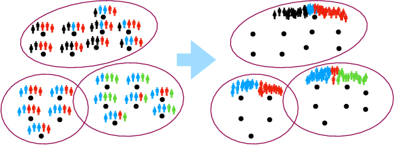

# CSCI 635 - Homework 3
We will be working on a problem known as [population-level label distribution learning (PLDL)](https://www.aaai.org/ojs/index.php/HCOMP/article/download/5286/5138/) for this question which will focus on clustering. Generally, unsupervised learning is used as a method to discover patterns in data when labels are not there. But, what do you do when you have labels? It is a common misconception that unsupervised learning is only for problems without labels, you can apply unsupervised learning for problems with labels as well (e.g., HW2 Last question). But when you do apply for problems with labels, labels are considered another set of features. This homework will also help you with formulating a methodology for the final milestone for your project. 

The main hypothesis of PLDL is that if two or more items share a similar label distribution, they can be clustered together. Once you do cluster them, each of these data items would have their original label distributions replaced by the label distribution of the cluster (label sharing between all items in the cluster). **By label distributions, this refers to a probability distribution of the labels**. 

In this question, we will focus on applying unsupervised learning to features (and associating labels). You are provided with a [dataset of facebook posts](https://github.com/minimaxir/interactive-facebook-reactions) (with the train/dev/test split) and with reactions (in this cases our labels). The following steps will guide you through on how to build your experimental setup for this question. We will be using [KL-divergence](https://en.wikipedia.org/wiki/Kullback%E2%80%93Leibler_divergence) as the loss function as we are working with probability distributions.

Dataset is included inside the **data/facebook** folder.

Recommended Dependencies; 
* Scikit-learn
* PyTorch
* [BERT Sentence Transformers](https://github.com/UKPLab/sentence-transformers#setup)

1. The **CS635_HW3.ipynb** will consist of basic functions to get started with the dataset and how to pre-process the data. This is a Jupyter notebook, I strongly encourage you to use this homework. For each question, create a section in your Jupyter notebook to separate the work.
2. [5 Pts] First stage, you are going to build a K-Means clustering model to cluster based on the features (in this case text). Since you can't directly cluster based on the words, first you are going to convert words into their sentence based vector representations using BERT. [This section on sentence-transformers will guide you through the process](https://github.com/UKPLab/sentence-transformers#clustering). 
3. [10 Pts] After you complete the previous question, you will have a k-means clustering model and a way to cluster posts. You can even view posts which belong to the same cluster. Now for PLDL, based on the posts assigned to a cluster, assign a label distribution to a cluster. To assign a label distribution to a cluster, find all the data items that belong to the cluster, generate an average label set for the cluster, and finally convert the average label set to a probability distribution. Based on the initial PLDL hypothesis, the label distribution assigned to a cluster is then shared by the individual data items in it. 
4. [5 Pts] Selecting the optimum number of clusters. You can experiment with the number of clusters, at minimum experiment with at least 30 clusters (e.g., repeat experiment by ranging the number of clusters from 4 to 34) and pick the optimum number of clusters. Generate a graph which shows the loss function value vs. number of clusters.
5. [10 Pts] The initial PLDL work is on clustering on the label space, repeat Part 3 using only labels instead of the text features. Draw a graph similar to Part 4 and discuss your findings. Does PLDL based on features work better than labels?
6. [Bonus 10 Pts] Repeat questions based on features and labels for PLDL, but with another set of unsupervised model (other than K-Means). Explain why you decided to use this unsupervised model.

## Submission Instructions

If you are submitting through GitHub, make sure you push the latest version of your code to the repo (once you sign up through the invitation link, it will create a private repo just for you) by submission deadline.

As a safety, upload a zipped version to MyCourses.